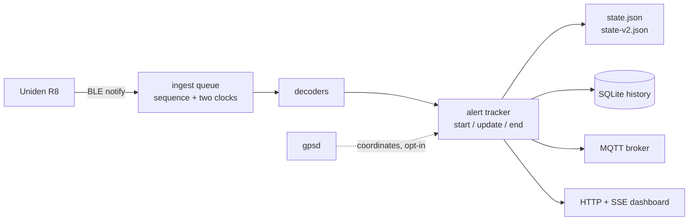

# uniden-r8-ble

**Get live radar-detector data out of a Uniden R8 over Bluetooth LE, on Linux.**

Voltage, GPS fix, heading and altitude at 1 Hz. Radar alerts as `start` / `update` / `end` events
with duration and peak strength. A local SQLite history you can query. MQTT with Home Assistant
discovery. A live web dashboard. And **no way to write anything to the detector** — not a disabled
path, an absent one.

[](https://github.com/JeremyWhittaker/unidenr8_bluetooth/actions/workflows/ci.yml)
[](LICENSE)
[](https://www.python.org/downloads/)
[](tests/)
[](docs/SAFETY.md)


---

## Why this exists

Uniden does not publish its Bluetooth API. Their R/Tach app talks to the detector, and until
recently the only way to learn how was to decompile it.

This project is a **working integration plus an evidence-graded protocol reference**. Every claim
about the wire format carries a grade saying where it came from — observed on real hardware, seen on
a different model, or decompiled from an app and never tested. That distinction is not academic:
about half of what is "known" about this protocol has never been confirmed against any detector, and
software that treats a guess as a fact will eventually tell a driver there is no threat when there
is one.

So the parser is deliberately conservative, the unknown fields are carried through raw instead of
being given invented meanings, and [`docs/PROTOCOL.md`](docs/PROTOCOL.md) tells you exactly which is
which.

## What you get

```console
$ uniden-r8 live --seconds 30

packets: 29 telemetry, 0 alert

  13.4 V     GPS locked

alerts: 0
  clear
```

```console
$ uniden-r8 history encounters

kind       at                        band  direction  duration_s  max_strength  max_raw_signal
alert_end  2026-09-02T22:41:07.412Z  KA    front      12.480      8             88
alert_end  2026-09-02T22:41:04.204Z  K     side       4.410       6             71
```

| Capability | Status |
|---|---|
| Discovery, pairing, identity, live telemetry | **Verified on hardware** — 508/508 packets parsed across four runs |
| Voltage, GPS fix state | **Verified** — the status letter decoded by correlation over a full cold start: `C` is a fix, `D` is not |
| Detector heading, speed, altitude | **Captured moving** — 2,636 packets, 0 unparsed, all 8 headings. Speed is mph (driver-corroborated); altitude is refuted as metres |
| Latitude/longitude in the live telemetry | **Not there.** [Measured on this R8, not assumed](docs/EVIDENCE.md) — the field upstream numbering suggests is a compass point. Use `gpsd` for continuous position. |
| Coordinates *stored* by the detector | **Open question.** It can save a user mark from its own fix, and that record is readable. Untested here — see [below](#the-coordinate-question). |
| Alert `start` / `update` / `end` events, duration, peak strength | **Implemented** |
| Band, strength, frequency, direction, mute | **Implemented; awaiting a real detection on a non-W R8** |
| SQLite history, MQTT + Home Assistant, live dashboard, `gpsd` fusion | **Implemented; each opt-in** |
| Settings / POI inspection | **Read-only, and only on an explicit `--confirm`** |
| Detector control — mute, marks, settings, firmware | **Absent by design** |

## Quick start

Any BlueZ Linux host. A Raspberry Pi is the intended target; a laptop works fine.

```bash
sudo apt install -y bluetooth bluez python3-venv
git clone https://github.com/JeremyWhittaker/unidenr8_bluetooth.git
cd unidenr8_bluetooth
python3 -m venv .venv && .venv/bin/pip install -e ".[ble]"

.venv/bin/uniden-r8 selftest      # prove the read-only controls; needs no radio
```

Put the detector into **MENU → BT Pairing**, turn Bluetooth off on any phone that normally connects
to it, then:

```bash
.venv/bin/uniden-r8 pair --confirm --then-read   # once
.venv/bin/uniden-r8 live --seconds 30            # look at it
```

Then install it as a service, so it is running the next time you drive:

```bash
.venv/bin/uniden-r8 config --example > unidenr8.toml   # then edit it
./scripts/install-service.sh                           # one sudo prompt
```

The installer derives every path from the tree it runs out of, refuses to install if the read-only
audit does not pass, warns you if history is switched off or the OBD guard names a unit this host
does not have — and then verifies the result by watching the packet counter move, because
`active (running)` only means the process has not exited yet.

If your host has no OBD-II adapter — most don't — set `guard = false` under `[obd]` first, or the
collector will refuse to run and be right to. Full operating procedure is in
[`docs/RUNBOOK.md`](docs/RUNBOOK.md).

> [!IMPORTANT]
> **Live telemetry is verified on real hardware. Active radar alerts are not.**
> Every field of an *active* alert is decoded from a protocol documented on an **R8w**, a different
> product. The only alert packet this project has ever seen from a real non-W R8 is all-clear
> (`0&0&0&0`). Treat any alert it reports as unvalidated. This is the single biggest gap, and
> [it is the easiest one to help with](#contributing).

## The coordinate question

Worth being precise about, because it is the thing people most often get wrong in both directions.

**The live telemetry packet carries no latitude or longitude.** That is measured on this detector,
not inferred from upstream: the four-field GPS sub-group is exactly the width a coordinate pair
would need, so the fields were read, and the first one is a compass point. There is a tripwire in
the parser that fires if two adjacent sub-fields ever both look like decimal degrees — if it fires,
the documentation is what needs correcting, not the tripwire.

**That is not the same as "the detector will not give you a position."** It plainly knows where it
is; it draws on saved camera locations. Uniden's own app can ask it to save a *user mark* at the
current location — the command carries no coordinates, so the detector must be filling them in from
its own fix — and that record is then readable from the POI characteristic. If that works on this
model, one button press yields one detector-derived coordinate.

Nobody has checked. This project has never read a populated POI database, on any detector, so:

- there is **no POI parser here**, deliberately. A parser that can appear to succeed on a structure
  nobody has seen populated would manufacture coordinates that somebody would believe, and its
  output is where people live.
- what there *is* is `inspection.evaluate_layouts()`, which runs **every** candidate record layout
  against the bytes and reports which one consumes the blob exactly. Two layouts are on file, one
  from upstream's numbers read as whole records and one read as payloads, and they are separately
  graded. One capture settles it, in either direction, and the tool says which.

The experiment is written up in [`docs/VALIDATION.md`](docs/VALIDATION.md) (V8). It needs no write
path: park, read the POI blob, press the physical MARK button once, read again, diff. Everything
stays in the owner-only private store.

For continuous position today, use `gpsd`. It lives in a separate `vehicle_gnss` branch that is
never merged with the detector's own fields, and it is off by default.

## How it works



Three design decisions are worth knowing before you read the code.

**Notifications are events, not samples.** An earlier version updated a variable in the BLE callback
and published on a timer, so an alert that began and cleared between two publications reached
nobody. Now the callback stamps two clocks, takes a sequence number and enqueues; a consumer derives
the transitions. A gap in the sequence is a *recorded* gap, not a silent one.

**Track identity is inference, and it says so.** Correlating an alert across snapshots is a guess —
the protocol's alert-id field reads `00` in every published capture. So the raw snapshots are the
record, the tracks are a derived view stamped with the matcher's version, and a close call is
flagged `ambiguous`. Direction is *geometry*, not identity: passing a fixed source walks front →
side → rear for one source, and an early matcher that keyed on it manufactured a fake end-and-start
at the most interesting moment of every encounter.

**Nothing slow runs on the event loop.** The same loop carries the BLE subscription, and on BlueZ a
client that stops draining its D-Bus socket is *disconnected*, not merely delayed. The OBD probe,
the SQLite writer and the state writes all run on threads, and a watchdog publishes the loop's own
lag so you can tell when that stops being true. On a Pi Zero 2 W it peaks around 2.6 ms.

[`docs/ARCHITECTURE.md`](docs/ARCHITECTURE.md) has the rest.

## Documentation

| | |
|---|---|
| [**HANDOFF**](docs/HANDOFF.md) | Start here if you are picking this up. What is proven, what is not, where to work. |
| [**PROTOCOL**](docs/PROTOCOL.md) | The wire format, field by field, with an evidence grade on every claim. |
| [**ARCHITECTURE**](docs/ARCHITECTURE.md) | Module map, data flow, threading model, and why each is shaped that way. |
| [**SCHEMA**](docs/SCHEMA.md) | The consumer contract: both state documents, event records, MQTT topics, SQLite tables. |
| [**CONFIGURATION**](docs/CONFIGURATION.md) | Every key, with three worked configurations. |
| [**RUNBOOK**](docs/RUNBOOK.md) | Operating procedure, firmware check to service install. |
| [**VALIDATION**](docs/VALIDATION.md) | The hardware test matrix — what is still waiting on a powered-on detector. |
| [**SAFETY**](docs/SAFETY.md) | The safety and privacy boundary, and what enforces each part. |
| [**EVIDENCE**](docs/EVIDENCE.md) | Every factual claim with its source and grade. Nothing asserted from memory. |

## Safety and privacy

**There is no application-characteristic write path.** Nothing writes to the Uniden command
characteristic; no mute, mute-memory, user-mark, camera-delete or settings command is ever sent.
That is proved by an AST audit of the package's own source, which runs in `selftest` and in CI, and
which has a companion test proving it can still fail.

This is a radio, so it does transmit: BlueZ scans actively, connecting and reading exchange frames,
and subscribing writes a standard CCCD descriptor. None of that carries an application command to
the detector, which is the distinction that actually protects it.

Bluetooth addresses become salted tokens. Coordinates are refused by the publication gate. Raw
captures stay in a git-ignored `0700` store, and the documents carrying the detector's own heading,
speed and altitude are `0600` and git-ignored too. A repository test scans every committable file
for an address-shaped literal, with no exception list.

If you run this alongside a vehicle's OBD-II adapter on a shared Bluetooth controller, the collector
checks that link before connecting and while connected, and lets go of the detector rather than
compete with it.

## Contributing

**The most valuable thing you can send is a capture from your own detector.**

Most of what is documented about *active* alerts comes from a single R8w. If you have an R4, R8, R9
or any of the "w" variants and you see a real alert, a bug report with the decoded packet and what
your detector's screen said will upgrade a whole row of the protocol table from inherited to
observed. There is an [issue template](.github/ISSUE_TEMPLATE/hardware-observation.yml) for exactly
that — it will also remind you to strip anything that is not protocol.

Code contributions are welcome too. Read [`docs/HANDOFF.md`](docs/HANDOFF.md) first: it lists the
invariants that must not break and why. The tests need no hardware, no broker, no `gpsd` and no
network — every external dependency has an injection seam.

```bash
.venv/bin/pip install -e ".[ble,dev]"
.venv/bin/python -m pytest -q
.venv/bin/ruff check .
```

## Credits

Protocol groundwork came from [AegisX86/UnidenR8wlink](https://github.com/AegisX86/UnidenR8wlink)
(MIT), by Aigis. This project treats those findings as evidence about an **R8w**, independently
verifies what applies to an **R8**, and does not copy the upstream source.

MIT licensed. Not affiliated with or endorsed by Uniden. This is diagnostic software and not a
substitute for the detector's own display or audible warnings — and nothing here is worth looking at
while you are driving.
