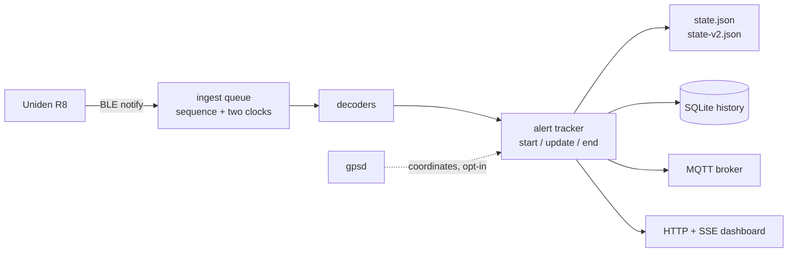

# uniden-r8-ble

**Put a Raspberry Pi in your car, wire it to a Uniden R8 radar detector over Bluetooth, and find
out what the thing actually knows.**

[](https://github.com/JeremyWhittaker/unidenr8_bluetooth/actions/workflows/ci.yml)
[](LICENSE)
[](https://www.python.org/downloads/)
[](tests/)
[](docs/SAFETY.md)


Uniden doesn't publish a Bluetooth API. Their R/Tach app talks to the detector, and until now the
only way to learn how was to decompile it and hope.

So we took an R8, a Pi Zero 2 W, and a truck, and worked it out from the wire — **on real hardware,
with every claim graded by where the evidence came from.**

---

## The good bits

**🛰️ We got GPS coordinates out of it. To 3.8 metres.**
The detector does *not* broadcast its position — we searched every attribute it exposes, in 40
encodings, with a positive control. But press its MARK button and it stores a coordinate derived
from its own fix, and that record reads straight back over Bluetooth. Measured against a reference
at two locations kilometres apart: **8.0 m and 3.8 m**.
→ [how that was established](docs/EVIDENCE.md)

**📡 There's a 1 Hz coordinate stream nobody had subscribed to.**
Enumerating the device's own GATT tree — instead of trusting a catalogue inherited from a different
model — turned up a characteristic that pushes the nearby saved-point window *once a second*, with
no command sent. It had been sitting there the whole time, written off in our own code as
"pointless".

**⚠️ A lowercase hex argument deletes the wrong saved location.**
The delete command takes a coordinate in hex. Send it lowercase and the detector doesn't reject it —
it acts on the mis-parse. We watched it report back a latitude a quarter of a degree from what we
sent, and a longitude that decoded to `3.5e-37`. Uppercase works perfectly. Nobody had documented
this, because nobody had sent the command to hardware before.

**📐 Every public source had the record layout wrong. Including ours.**
Two competing readings of the POI record lengths existed. Rather than pick one, the tool evaluates
*both* against real bytes and reports which consumes the blob exactly. The first populated POI read
on any R-series detector settled it — **13 / 12 / 10** — and refuted the reading this project had
been carrying.

---

## What it does

| | |
|---|---|
| 🟢 **Live telemetry at 1 Hz** | Voltage, GPS fix state, 8-point heading, speed, altitude. 2,636 packets on a moving vehicle, **zero decode errors** |
| 🟢 **Radar alerts as events** | `start` / `update` / `end` with duration and peak strength. Proven on a real Ka encounter — strength peaked at 8 bars and direction walked front → side → rear as the vehicle passed |
| 🟢 **Local SQLite history** | Every session, queryable, survives a power cut mid-write |
| 🟢 **Runs unattended** | systemd service, starts with the vehicle, reconnects on its own |
| 🟢 **Read a drive back** | One command tells you what a trip actually captured |
| 🟢 **MQTT + Home Assistant** | Auto-discovery, opt-in |
| 🟢 **Live web dashboard** | Server-sent events, no framework, no build step |
| 🟢 **Plays nicely with OBD-II** | Shares one Bluetooth radio with a vehicle OBD adapter and yields rather than competes |

And the honest other half — because a project that only lists wins isn't worth trusting:

| | |
|---|---|
| 🟢 **A real Ka encounter, captured and confirmed.** 252 packets, 0 rejected. Band, strength 1–8, raw signal, frequency and direction all now **observed** — and the decoded 35.478 GHz matches what the driver read off the detector's own screen | [details](docs/EVIDENCE.md) |
| 🔴 **No live position feed.** Not in telemetry, not anywhere — searched directly, with a control | [details](docs/CAPABILITIES.md) |
| 🟡 **The settings blocks are 240 opaque bytes** we can read and can't decode | [details](docs/CAPABILITIES.md) |
| ⚪ **MQTT, the dashboard and the GPS client have never met real hardware** | [details](docs/CAPABILITIES.md) |

**→ [Full capability inventory](docs/CAPABILITIES.md)** — everything that works, everything that
doesn't, and the evidence for each.

---

## Try it

Any Linux box with BlueZ. A Raspberry Pi is the intended target; a laptop works fine.

```bash
sudo apt install -y bluetooth bluez python3-venv
git clone https://github.com/JeremyWhittaker/unidenr8_bluetooth.git
cd unidenr8_bluetooth
python3 -m venv .venv && .venv/bin/pip install -e ".[ble]"

.venv/bin/uniden-r8 selftest      # proves the read-only controls; needs no radio
```

Put the detector into **MENU → BT Pairing**, turn Bluetooth off on any phone that normally connects
to it, then:

```bash
.venv/bin/uniden-r8 pair --confirm --then-read   # once
.venv/bin/uniden-r8 live --seconds 30            # look at it
```

```console
$ uniden-r8 live --seconds 30

packets: 29 telemetry, 0 alert

  13.4 V     GPS locked

alerts: 0
  clear
```

Then install it as a service, so it's running next time you drive:

```bash
.venv/bin/uniden-r8 config --example > unidenr8.toml   # then edit it
./scripts/install-service.sh                           # one sudo prompt
```

The installer derives every path from the tree it runs in, refuses to install if the read-only
audit fails, warns you if history is switched off — and verifies success by **watching the packet
counter move**, because `active (running)` only means the process hasn't exited yet.

No OBD-II adapter? Set `guard = false` under `[obd]` first, or the collector will refuse to run and
be right to. Full procedure in the [runbook](docs/RUNBOOK.md).

---

## Why everything here is graded

Every factual claim in this repository carries a grade: **measured on this detector**, **seen on a
different model**, **decompiled from an app and never tested**, or **inference**.

That isn't academic. About half of what's publicly "known" about this protocol has never been
confirmed against any detector, and software that treats a guess as a fact will eventually tell a
driver there's no threat when there is one.

So the parser is deliberately conservative, unknown fields are carried through raw instead of being
given invented meanings, and [`PROTOCOL.md`](docs/PROTOCOL.md) tells you which is which. When a
measurement contradicts something we'd written, the write-up says so — [several
have](docs/EVIDENCE.md).

---

## How it works



Three decisions worth knowing before you read the code:

**Notifications are events, not samples.** An earlier version updated a variable and published on a
timer, so an alert that began and cleared between two publications reached nobody. Now the callback
stamps two clocks, takes a sequence number and enqueues. A dropped notification is a *recorded* gap,
not a silent one.

**Track identity is a guess, and it says so.** The protocol's alert-id field reads `00` in every
published capture, so correlating an alert across snapshots is inference. The raw snapshots are the
record; the tracks are a derived view stamped with the matcher's version.

**Nothing slow runs on the event loop.** It carries the BLE subscription, and on BlueZ a client that
stops draining its D-Bus socket is *disconnected*, not merely delayed. The OBD probe, the SQLite
writer and the state writes all run on threads, and a watchdog publishes the loop's own lag — on a
Pi Zero 2 W it peaks around 2.6 ms.

[`ARCHITECTURE.md`](docs/ARCHITECTURE.md) has the rest.

---

## Documentation

| | |
|---|---|
| [**CAPABILITIES**](docs/CAPABILITIES.md) | What works, what doesn't, what's untested — start here |
| [**EVIDENCE**](docs/EVIDENCE.md) | Every claim with its source and grade. Nothing asserted from memory |
| [**PROTOCOL**](docs/PROTOCOL.md) | The wire format, field by field |
| [**HANDOFF**](docs/HANDOFF.md) | Picking this up? Read this first |
| [**ARCHITECTURE**](docs/ARCHITECTURE.md) | Module map, data flow, threading model |
| [**SCHEMA**](docs/SCHEMA.md) | The consumer contract: state documents, events, MQTT topics, SQLite tables |
| [**CONFIGURATION**](docs/CONFIGURATION.md) | Every key, with four worked configurations |
| [**RUNBOOK**](docs/RUNBOOK.md) | Operating procedure, firmware check to service install |
| [**VALIDATION**](docs/VALIDATION.md) | The hardware test matrix — what's still waiting on a detector |
| [**SAFETY**](docs/SAFETY.md) | The safety and privacy boundary, and what enforces each part |

---

## Safety and privacy

**The installed package cannot write to the detector.** Nothing in it puts an application value on a
vendor characteristic — no mute, mark, camera-delete or settings command. That's proved by an AST
audit of the package's own source, which runs in `selftest` and in CI, and which has a companion
test proving it can still fail.

Commands *have* been sent, from standalone scripts outside the package and at the owner's explicit
instruction — that's how the coordinate results above exist. [`SAFETY.md`](docs/SAFETY.md) says so
plainly, rather than leaving it to a commit message.

Bluetooth addresses become salted tokens. Coordinates are refused by the publication gate. Raw
captures live in a git-ignored `0700` store, and documents carrying the detector's own heading,
speed and altitude are `0600` and git-ignored too. A repository test scans every committable file
for an address-shaped literal, with no exception list.

This is a radio, so it *does* transmit: BlueZ scans actively, and subscribing writes a standard CCCD
descriptor. None of that carries an application command to the detector — which is the distinction
that actually protects it.

---

## Contributing

**The most valuable thing you can send is a capture from your own detector.**

Most of what's documented about *active* alerts comes from a single R8w. If you have an R4, R8, R9
or any "w" variant and you see a real alert, a bug report with the decoded packet and what your
detector's screen said will upgrade a whole row of the protocol table from inherited to observed.
There's an [issue template](.github/ISSUE_TEMPLATE/hardware-observation.yml) for exactly that — it
also reminds you to strip anything that isn't protocol.

Code contributions welcome too. Read [`HANDOFF.md`](docs/HANDOFF.md) first: it lists the invariants
that must not break, and why. The tests need no hardware, no broker, no `gpsd` and no network —
every external dependency has an injection seam.

```bash
.venv/bin/pip install -e ".[ble,dev]"
.venv/bin/python -m pytest -q
.venv/bin/ruff check .
```

---

## Credits

Protocol groundwork came from [AegisX86/UnidenR8wlink](https://github.com/AegisX86/UnidenR8wlink)
(MIT), by Aigis. This project treats those findings as evidence about an **R8w**, independently
verifies what applies to an **R8**, and does not copy the upstream source.

MIT licensed. Not affiliated with or endorsed by Uniden. This is diagnostic software and not a
substitute for the detector's own display or audible warnings — and nothing here is worth looking at
while you're driving.
